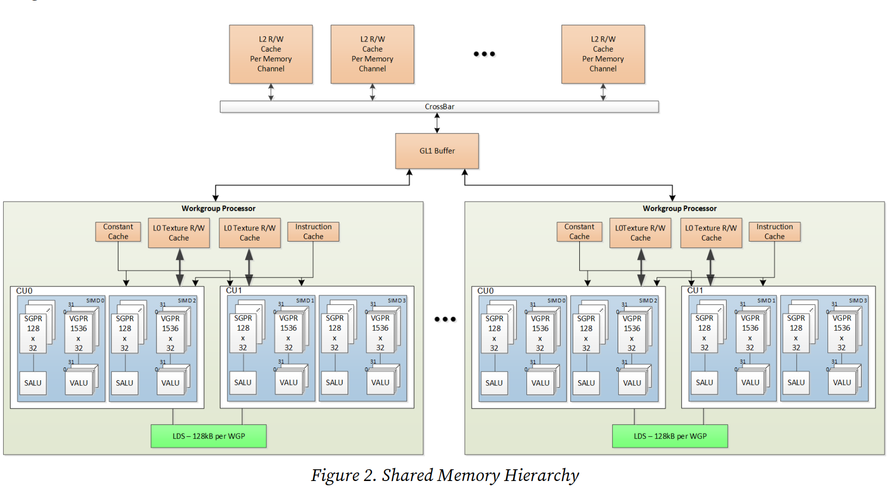

# AMD RDNA4のハードウェアの概要

この記事は[AMD "RDNA4" Instruction Set Architecture Reference Guide](https://www.amd.com/content/dam/amd/en/documents/radeon-tech-docs/instruction-set-architectures/rdna4-instruction-set-architecture.pdf)の1章1.2節「ハードウェアの概要」に基づいて自分が理解できるように書き直した。

GPGPUに必要な事柄に絞って解説する。
RDNA4ではプロセッサーはWork-Group Processor(WGP)と呼ばれる、メモリや演算装置を含んだハードウェアからなる。
各WGPは互いに独立に動作する。
WGPの内部について詳しく見ていく。

<figure markdown="span">
  { width="auto" }
  <figcaption>共有メモリ階層</figcaption>
</figure>

## タスクの単位
AMDとNVIDIAでは、用語が異なるため整理する。
AMDでは仕事の最小分割単位をwork-itemと呼び、CUDAでのthreadに相当する。
また、単一のRDNA4プロセッサー上で並列に実行できる32個または64個のwork-itemの集まりをWave(またはWavefront)と呼ぶ。

## Compute Unit(CU)
WGPの内部には2つのCompute Unit(CU)があり、1つのCUには2つのSIMDがある。
SIMDには以下のハードウェアがある:

- 1 x Scalar ALU (SALU):  wave毎に1つの値を操作し、すべての制御フロー(if/else、ループ)を管理する。
- 32 x Vector ALU (VALU):  各work-item上で同じ算術操作を行う

さらに、これらのALUにはデータとアドレスを保存できるGeneral Purpose Register(GPR)があり、機能が異なる。

- SALU: 各wave内のwork-itemに共有される、4バイト単位のレジスター(Scalar GPR, SGPR)が128バイト x 32個ある。
- VALU: wave内の各work-itemが持つ、4バイト単位のレジスター(Vector GPR, VGPR)が1536バイト x 32個ある。waveが32個なら16ブロック、64個なら8ブロック毎に確保される(つまり512 x 4バイト単位で確保される)。

VGPRはWaveの各work-itemに必要な分だけレジスターを確保する。
また、条件分岐をサポートするために、各waveは各work-itemがアクティブか眠っているかを示すEXECuteマスクを持っている。
アクティブなwork-itemはベクター命令をを実行し、眠っているものはNOPとして命令を実行する。
EXECマスクはSALUまたはVALUの比較によって、いつでも書き換えられる。

## Local Data Share(LDS)
2つのCU間でデータを共有できるメモリがあり、これをLocal Data Share(LDS)という。
LDSはWGP毎に1つあり、大きさが128kBで低レイテンシーでアクセスできる。
LDSは4バイトの512エントリーを持つ、64個のバンクに分割されていて、順不同なアトミック命令を速くするために64個の整数アトミックユニットを含んでいる。

## Work-group
キャッシュまたはLDSを通してデータを共有したり、バリアで同期できるwaveの集まりをWork-groupと呼ぶ。
work-group内のwaveはすべて同じWGP上で動く。

work-groupは1つあたり最大64kBのLDSのメモリを確保できる。

## 参考
1. [AMD "RDNA4" Instruction Set Architecture Reference Guide](https://www.amd.com/content/dam/amd/en/documents/radeon-tech-docs/instruction-set-architectures/rdna4-instruction-set-architecture.pdf)
2. [GPUアーキテクチャとGPUプログラミングの話が面白かった](https://qiita.com/Koya_/items/28446be12252edc06137)
