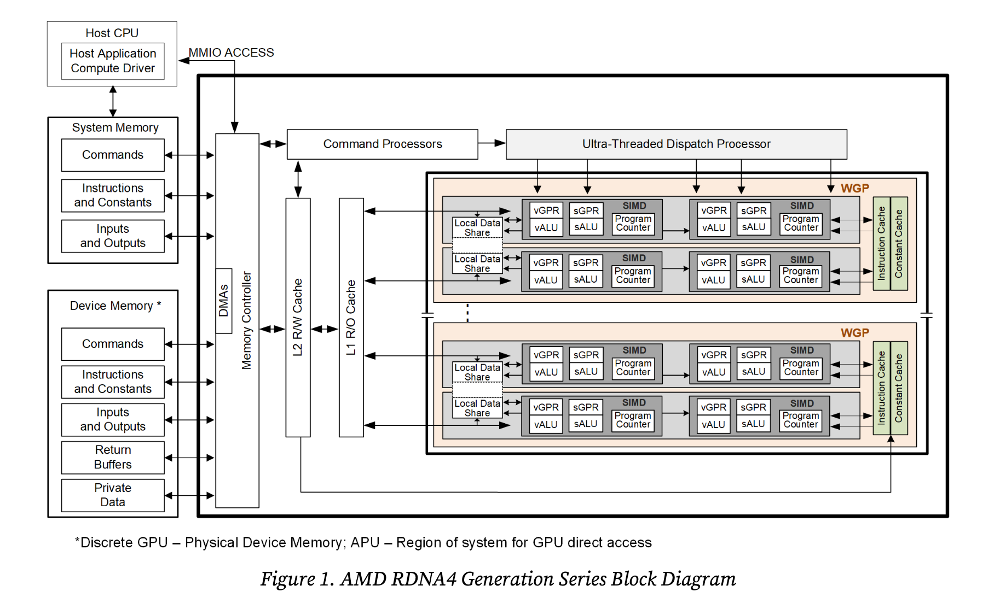

# AMD RDNA4のハードウェアの概要

この記事は[AMD "RDNA4" Instruction Set Architecture Reference Guide](https://www.amd.com/content/dam/amd/en/documents/radeon-tech-docs/instruction-set-architectures/rdna4-instruction-set-architecture.pdf)の1章1.2節「ハードウェアの概要」の自分用のメモ書きです。

## 用語
| 用語 | 説明 |
|--|--|
| Work-group Processor(WGP) | スカラーまたはベクターALU、メモリ、LDS、スカラーキャッシュを含む、シェーダー計算ハードウェアの最小単位。ある文脈では、"Double Compute Unit"や"Compute Unit Pair"と呼ばれる |

## 

<figure markdown="span">
  { width="auto" }
  <figcaption>AMD RDNA4のブロック図</figcaption>
</figure>

## Work-Group Processor

